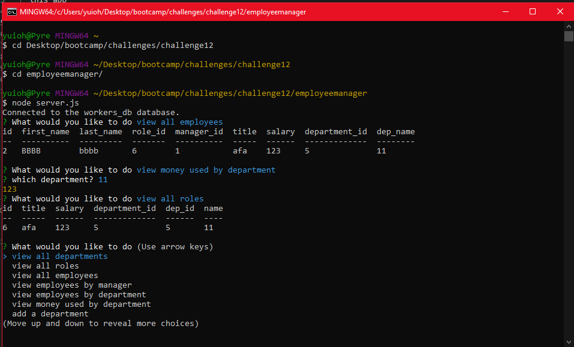

# employee manager
  ## description 
  this app is made to help people modify create and update a company and its group of employees
  ## usage 
  to use the app open the file via git bash and run "npm i" then run my sql log on and then source ./db/schema.sql and source ./db/seeds.sql then finally run node server.js and ou should be resented with all your options to add, view, edit, and update whichever employee you need
  
  

  tutorial link:
  https://youtu.be/Dg7yJO8bTq0
